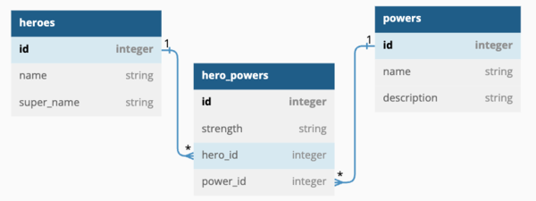

# Superheroes API

## Objectives

- Use Flask-SQLAlchemy to define a data model
- Use Flask-SQLAlchemy to join tables with many-to-many relationships.
- Use SQLAlchemy-Serializer to serialize an object
- Implement a Flask application that queries the database
- Implement a Flask application that returns a JSON response
- Ensure that only acceptable input is sent to the database using validations.
- Use Flask-Migrate to manage changes to a database schema.
- Create an API with Flask that allow CRUD requests.

---

## Contact Information
For questions, suggestions, or contributions, feel free to reach out:

- Developer: [Dedan Opiyo]

- Email: [dedandedan2@gmail.com]

- GitHub: https://github.com/DedanOpiyo?tab=repositories


## Setup

Fork and clone the lab repo.

Run `pipenv install` and `pipenv shell` .

```console
$ pipenv install
$ pipenv shell
```

Change into the `server` directory and configure the `FLASK_APP` and
`FLASK_RUN_PORT` environment variables:

```console
$ cd server
$ export FLASK_APP=app.py
$ export FLASK_RUN_PORT=5555
```

### Project Structure

You can run `tree` in your terminal to view the file layout. 
```console
$ tree
```

The `server` folder initially contains two files, `app.py` and `models.py`.

```console
.
├── Pipfile
├── Pipfile.lock
├── README.md
└── server
    ├── api_exception.py
    ├── app.py
    ├── instance
    │   └── superheroes.db
    ├── migrations
    │   ├── README
    │   ├── alembic.ini
    │   ├── env.py
    │   ├── script.py.mako
    │   └── versions
    │       └── c25419a2a194_initial_migration.py
    ├── models.py
    └── seed.py

5 directories, 13 files
```

## Define the models

### Migrations and Seeding
After defining the `models` in `models.py` file, and setting up our `flak app` in `app.py` file, 
we run `migrations` to create our database.  

We then `seed` the database and begin defining our `routes and views`.

To complete the migrations and create our tables we run the following commands withon `server` director:
```console
$ cd server
$ flask db init
$ flask db migrate -m 'initial migration'
$ flask db upgrade head  
```
> **Aside:** If we were to `downgrade` or `upgrade` our `shema` or models, we would need to `modify` the `env.py` file (automatically
> created inside the `migrations` folder) to `ensure` that `Alembic generates migrations in batch mode`. We would specifcally 
> `modify` the `context.configure()` block in the env.py by `including` the line: `render_as_batch=True,`

Populate the tables by running
```console
$ python seed.py
```
As an alternative to seed file https://moringa.instructure.com/courses/1028/files/541421?wrap=1 download, seed.py is available if
you chose to clone the repo.

### Models
We have implemented an API for the following data model:



These are the logic that guided relationships in our models as shown in the ER Diagram:

### Pseudocode

- A `Hero` has many `Power`s through `HeroPower`
- A `Power` has many `Hero`s through `HeroPower`
- A `HeroPower` belongs to a `Hero` and belongs to a `Power`

Since a `HeroPower` belongs to a `Hero` and a `Power`, configure the model to cascade deletes.

Set serialization rules to limit the recursion depth.  

You can view the final implementation at the bottom of this README.


## Serialization and Relationships

`SQLAlchemy-Serializer` has been used to `convert` `SQLAlchemy objects` with relationships into `dictionaries`.  
Each of the models inherit from `SerializerMixin` class imported from sqlalchemy_serializer, thus,
our models now have a range of methods for serializing and deserializing data.  

One such method is `to_dict()`, that converts the model object into a dictionary, another is `to_json()` that also convert model object/instance into a JSON string.  
These come in handy when we want to structure our API responses to client-readable formats such as JSON format.  

`Relationships` among models often result in `recursion` especially when one model references another, which may then in one way or another reference it back, 
causing unending loop. `Serialization rules` help us `overcome` this `challenge`, thus elievating the sturbon `RecursionError`.

### Serializer Rules

In our case `Hero`, and `Power` model have `many-to-many relationship` through an association model, `HeroPower`, thus,
through hero and power (relationship) attributes (in Heropower), accessing `hero_powers` from `Hero` or `power_heroes` from `Power` causes `recursion`, since 
hero_powers are technicaly `objects` of `HeroPower class` and guess what? `they have power(s) which have heroe(s)`. 

To manage this situation (`layers of nested structures or relationships`) we have used **serialize_rules** class attribute in each of our models `to dictate what
to exclude` - (fields/attributes) thereby `reducing the recursion depth`. 

```console
# In Hero
serialize_rules = ('-hero_powers.hero', '-powers.heroes',)

# In Power
serialize_rules = ('-hero_powers.power', 'heroes.powers',)

# In HeroPower
serialize_rules = ('-hero.hero_powers', '-power.hero_powers', '-hero.powers', '-power.heroes',)
```

Another alternative is to specify `which fiels` we want `to include` in the `serialization` using **serialize_only.**

### Serialize Only

For our case, using **serialize_only.** was more specific. 

```console
# In Hero
serialize_only = ('id', 'name', 'super_name', 'hero_powers', )

# In Power
serialize_only = ('id', 'name', 'description', )
```

These yield the desired outcome where the JSON data we 'return' to the client will appear like this:
```console
# a. GET /heroes
# Return JSON data in the format below:
[
 {
  "id": 1,
  "name": "Kamala Khan",
  "super_name": "Ms. Marvel"
 },
 {
  "id": 2,
  "name": "Doreen Green",
  "super_name": "Squirrel Girl"
 },
  
  ...

 {
  "id": 10,
  "name": "Elektra Natchios",
  "super_name": "Elektra"
 }
]
```

```console
# b. GET /heroes/:id
# If the `Hero` exists, return JSON data in the format below:
{
  "id": 1,
  "name": "Kamala Khan",
  "super_name": "Ms. Marvel",
  "hero_powers": [
     {
       "hero_id": 1,
       "id": 1,
       "power": {
              "description": "gives the wielder the ability to fly through the skies at supersonic speed",
              "id": 2,
              "name": "flight"
        },
       "power_id": 2,
       "strength": "Strong"
        }
   ]
}
```

and so on.  

Additionally, within the routes (explained below), we particularly specified what to leave out, when calling the `.to_dict()` method.  

```console
# Within /heroes route

...
heroes = [hero.to_dict(rules=('-hero_powers',)) for hero in heroes]
...
```

**Notice** `to_dict(rules=('-hero_powers',))`, we have `excluded` `hero_powers` attribute (`in Hero model`) at the point of serializing our hero object/instance.
This specification alongside the serialize_only attribute we used in Hero model ensures we get the desired output, shown above, for the `GET /heroes` route.  

in the `GET /heroes/:id` route, the implementation was as follows:  
```console
# Within @app.route('/heroes/<int:id>', methods=['GET'])

...
hero_dict = hero.to_dict(rules=('-hero_powers.hero',))
...
```

`hero attribute` (of `HeroPower` model) is `excluded`. It is important to **note** that hero_powers (attribute of Hero class) is not excluded, but rather the specific attribute hero
that each of the hero_powers will have.

## Routes & Views

Some of the `routes` in `app.py` file are shown below
(Explanation for error handling is discussed in the following sections).

Major areas to point out here is the nature in which the routes have been structured, how the requests have been handled and 
the state(format) in which the responses are sent to the client. 

### Route Grouping
Requests that are not specific to a particular resource are grouped together in 'plain' routes *routes with no parameters* i.e.
/heroes, /powers, /hero_powers.  

These routes handles 'GET' and 'POST' requests since we do not need specific identifiers to complete these operations.  

Those that specifies identifiers as /heroes/<int:id>, /powers/<int:id>, /hero_powers/<int:id>, resolves 'PATCH', 'DELETE' and 'GET'(particular resource) *methods*.  

This is because (1) a resource of interest is already retrieved from the database, so we can end either action if the resource is not found. 
(2) this patters is recognized by REST and will make our routes adopt quickly to the convention later on if we are to adopt it.  
Our API logic become predictable.

### Views and Response

These are typicaly `functions` that `processes` our `requests` (views), and return `response` in the `desirable format` for the `client`.  

Our views, depending on which route group, either, retrieve all resources from a particular model/table (route names as a convention can help us tell which table we are querying-to avoid confusion) retrieve a specific resource/object/raw from the table, instantiate a model(in the case of POST requests), or update a model 
with the provided attributes(in the case of PATCH request).  

'PATCH' and 'POST' requests are either in form or JSON format, so we either retrieve them using request.get_json() or request.form. Our routes expects JSON requests
so the former is used.  

While we instantiate our model for 'POST' requests, we dynamically set attributes for 'PATCH' requests. Take a look at updating a power, shown below.

```console
    if request.method == 'PATCH':
        data = request.get_json()
        if not data:
            return jsonify({"error": "No update field provided."}), 404
        for attr in data:
            try:
                setattr(power, attr, data[attr])
            except:
                return jsonify({"errors": ["validation errors"]}), 404
        db.session.commit()
        data_dict = power.to_dict()
        return make_response(data_dict, 200)
 ```

We are `iterating` over the `request information(data)`, and using `setattr()` method to dynamically update the provided fields in our database/table - Through 
the power object. It is important to note that the object was retrieved at the 'top' of our view function as we stated earlier. i.e.
`power = Power.query.get(id)`

Finally, before returning the response to the client, we use to_dict() method as we discussed earlier to serielize our response.  
In other cases you might see:
```console
jsonify(dict/response), status_code
```

especially when we do not use `make_response()`. In this case we Jsonify our data, a dictionary in most cases, before returning it to the client. 
We also don't forget to specify the status code.

```console
# server/app.py
#!/usr/bin/env python3
from api_exception import APIException
from flask import jsonify

from flask import Flask, make_response, request
from flask_migrate import Migrate
from werkzeug.exceptions import NotFound

from models import db, Hero, Power, HeroPower

# Flask application object
app = Flask(__name__)

# Configuration string for database connection
app.config['SQLALCHEMY_DATABASE_URI'] = 'sqlite:///superheroes.db'

# Disabling modification tracking to use less memory
app.config['SQLALCHEMY_TRACK_MODIFICATIONS'] = False

# Creating Migrate object to manage schemas modifications
migrate = Migrate(app, db)

# Initializing the Flask application to use the database
db.init_app(app)


# Routes & Views
@app.route('/')
def index():
    response_body = f'''
        <h1>Home of Super Heroes</h1>
        <h3>This is the root path of super heroes app.</h3>
    '''
    headers = {}
    return make_response(response_body, 200, headers)

@app.route('/heroes', methods=['GET'])
def heroes():
    heroes = Hero.query.all()
    if not heroes:
        raise APIException("No heroes added yet. Please add one first.")
    heroes = [hero.to_dict(rules=('-hero_powers',)) for hero in heroes]
    return make_response(heroes, 200)

@app.route('/heroes/<int:id>', methods=['GET'])
def hero_by_id(id):
    hero = Hero.query.get(id)
    if not hero:
        return jsonify({"error": "Hero not found"}), 404
    hero_dict = hero.to_dict(rules=('-hero_powers.hero',))
    return make_response(hero_dict, 200)

@app.route('/powers', methods=['GET'])
def powers():
    powers = Power.query.all()
    if not powers:
        raise APIException("No powers added yet. Please add one first.")
    powers = [hero.to_dict(rules=('-hero_powers',)) for hero in powers]
    return make_response(powers, 200)

@app.route('/powers/<int:id>', methods=['GET', 'PATCH'])
def power_by_id(id):
    power = Power.query.get(id)
    
    if not power:
        return jsonify({"error": "power not found"}), 404
    
    if request.method == 'GET':
        power_dict = power.to_dict(rules=('-power_heroes.power',))
        return make_response(power_dict, 200)

    if request.method == 'PATCH':
        data = request.get_json()
        if not data:
            return jsonify({"error": "No update field provided."}), 404
        for attr in data:
            try:
                setattr(power, attr, data[attr])
            except:
                return jsonify({"errors": ["validation errors"]}), 404
        db.session.commit()
        data_dict = power.to_dict()
        return make_response(data_dict, 200)

@app.route('/hero_powers', methods=['POST'])
def post_hero_power():
        data = request.get_json()
        if not data:
            return jsonify({"error": "No update field provided."}), 404
        
        try:
            new_hero_power = HeroPower(
                strength=data["strength"],
                hero_id=data["hero_id"],
                power_id=data["power_id"]
            )
            
            db.session.add(new_hero_power)
            db.session.commit()
        
        except:
            return jsonify({"errors": ["validation errors"]}), 422
        

        return make_response(new_hero_power.to_dict(rules=('-hero.hero_powers', '-power.power_heroes',)), 201)

# Error handlers
@app.errorhandler(NotFound)
def handle_not_found(e):
    description = e.description.strip() or "Not Found: The requested resource does not exist."
    return make_response({"error": description}, 404)

@app.errorhandler(APIException)
def handle_api_exception(e):
    return make_response(jsonify(e.to_dict()), e.status_code)

if __name__ == '__main__':
    app.run(port=5555, debug=True)
```

## Error Handling

Error handler decorator, `app.errorhandler()` has been used to communicate clearly, with the client, effectively 
providing informative feedback of what transpired on the server side.

To use it, we need a `parameter`, the right `exception` which we import from `werkzeug.exceptions`. 
Among the exceptions is a NotFound which has been used as so:  

```console
# Error handlers
@app.errorhandler(NotFound)
def handle_not_found(e):
    description = e.description.strip() or "Not Found: The requested resource does not exist."
    return make_response({"error": description}, 404)
```

and inside the route(s):
```console
    if not heroe:
        raise NotFound('Hero not found')
```

Flask catches the `exception` and `routes` it to the `matching` @app.errorhandler(NotFound) `function`.   
Once the right error handler has been found, flask `calls` the function, passing `the exception instance` as its `argument`.  

We can create a `response` with the information retrieved from the e `instance`.

### Custom Error Handling

We have created a custom error handler:

```console
@app.errorhandler(APIException)
def handle_api_exception(e):
    return make_response(jsonify(e.to_dict()), e.status_code)
```

`APIException` is a class we have `created` that `inherits` from `Exception`.   
Other than using `Exception` for our error handling, we `extend` its features by `subclassing it`. 
We then `enrich` it with `extra data` (`status code, payload`). We do this because Exception as it is will not give us
specific errors or messages that our clients will find useful and spot on on the exact issue.

```console
# server/api_exception.py

class APIException(Exception): # Subclass Exception to extend/augment/enrich/customize its behavior
    status_code = 500

    def __init__(self, message, status_code=None, payload=None):
        self.message = message
        self.status_code = status_code or self.status_code
        self.payload = payload or {}

    def to_dict(self):
        response_dict = dict(self.payload) # Copy payload
        response_dict['error'] = self.message # Response_dic to always have this attr       
        return response_dict
```

We use it as any other error handler.
When we instantiate the class:

```console
raise APIException("Something went wrong")

or

raise APIException("Validation failed", 422, payload={"field": "name", "reason": "missing"})
```

The client receives ir:
```console
{'error': 'Something went wrong'}
```  
or
```console
{
  "error": "Validation failed",
  "field": "name",
  "reason": "missing"
}
```

## Conclusion

This project showcases the development of a clean, well-structured Flask-based API aligned with RESTful best practices and scalable design principles. Through thoughtful use of Flask extensions and Python tooling, we achieved our implementation goals while maintaining readability, modularity, and performance.

Key highlights of the project include:

  - Built a **Flask API** that supports full **CRUD operations** and returns appropriate **HTTP status codes** for both success and error scenarios.

  - Implemented models using **Flask-SQLAlchemy**, including complex **many-to-many relationships**.

  - Serialized objects using **SQLAlchemy-Serializer** to return clean, structured **JSON responses** via `to_dict()`.

  - Controlled response depth and avoided circular references by applying **serializer rules** effectively.

In addition, a custom `APIException` class was implemented to **standardize error handling**, ensuring consistent and informative responses across the API. Input validation safeguards were added to protect data integrity, and **Flask-Migrate** was used to manage schema evolution seamlessly.

Altogether, this project reflects a sound understanding of RESTful API design and forms a solid base for extending into more complex and scalable Flask applications.

## Models.py

```console
# server/models.py

from flask_sqlalchemy import SQLAlchemy
from sqlalchemy import MetaData
from sqlalchemy_serializer import SerializerMixin
from sqlalchemy.orm import validates
from sqlalchemy.ext.associationproxy import association_proxy

metadata = MetaData(naming_convention={
    "fk": "fk_%(table_name)s_%(column_0_name)s_%(referred_table_name)s",
})

db = SQLAlchemy(metadata=metadata)

class Hero(db.Model, SerializerMixin):
    __tablename__ = 'heroes'

    # serialize_rules = ('-hero_powers.hero', '-powers.heroes',) # serializer rules 
    serialize_only = ('id', 'name', 'super_name', 'hero_powers', )

    id = db.Column(db.Integer, primary_key=True)
    name = db.Column(db.String, nullable=False)
    super_name = db.Column(db.String, nullable=False)

    # Relationships
    hero_powers = db.relationship('HeroPower', back_populates='hero')
    
    # Association proxy to get powers of this hero through hero_powers
    powers = association_proxy('hero_powers', 'power', 
                               creator=lambda power_obj: HeroPower(power=power_obj))
    
    # Validations
    @validates('name')
    def validate_name(self, key, value):
        if not value:
            raise ValueError("A hero must have a name.")
        return value

    @validates('super_name')
    def validate_name(self, key, value):
        if not value:
            raise ValueError("A hero must have a super_name.")
        return value

    def __repr__(self):
        return f"Hero id={self.id}, name={self.name}, super_name={self.super_name}"
    
class Power(db.Model, SerializerMixin):
    __tablename__ = 'powers'

    # serialize_rules = ('-hero_powers.power', 'heroes.powers',) 
    serialize_only = ('id', 'name', 'description', )

    id = db.Column(db.Integer, primary_key=True)
    name = db.Column(db.String, nullable=False)
    description = db.Column(db.String, nullable=False)

    # Relationships
    power_heros = db.relationship('HeroPower', back_populates='power')

    # Association proxy to get heroes of this power through hero_powers
    heroes = association_proxy('hero_powers', 'hero', 
                               creator=lambda hero_obj: HeroPower(hero=hero_obj))
    
    # Validations
    @validates('name')
    def validate_name(self, key, value):
        if not value:
            raise ValueError("A hero must have a name.")
        return value
    
    @validates('description')
    def validate_description(self, key, value):
        if not value or len(value) < 20:
            raise ValueError('Power description should be at leas 20 characters long.')
        return value
    
    def __repr__(self):
        return f"Power id={self.id}, name={self.name}, description={self.description}"
    
class HeroPower(db.Model, SerializerMixin):
    __tablename__ = 'hero_powers'

    serialize_rules = ('-hero.hero_powers', '-power.hero_powers', '-hero.powers', '-power.heroes',) # This is a tupple

    id = db.Column(db.Integer, primary_key=True)
    strength = db.Column(db.String(8), nullable=False)
    # Foreign Keys
    hero_id = db.Column(db.Integer, db.ForeignKey('heroes.id'), nullable=False)
    power_id = db.Column(db.Integer, db.ForeignKey('powers.id'), nullable=False)

    # Relationships
    hero = db.relationship('Hero', back_populates='hero_powers')
    power = db.relationship('Power', back_populates='power_heros')
    
    # Validations
    @validates('strength')
    def validate_strength(self, key, value):
        if value not in ['Strong', 'Weak', 'Average']:
            raise ValueError("HeroPower strength must be either: 'Strong', 'Weak' or 'Average'.")
        return value
    
    @validates('hero_id')
    def validate_hero_id(self, key, value):
        if not isinstance(value, int):
            raise ValueError("HeroPower hero_id must be a valid integer.")
        return value

    @validates('power_id')
    def validate_power_id(self, key, value):
        
        if not isinstance(value, int):
            raise ValueError("HeroPower power_id must be an integer.")
        return value

    def __repr__(self):
        return f"HeroPower id={self.id}, strength={self.strength}, hero_id={self.hero_id}, power_id={self.power_id}"
```

## Resources

- [Quickstart - Flask-SQLAlchemy][flask_sqla]
- [Flask-Migrate](https://flask-migrate.readthedocs.io/en/latest/)
- [SQLAlchemy-Serializer](https://pypi.org/project/SQLAlchemy-serializer/)
- [Flask - Pallets](https://flask.palletsprojects.com/en/2.2.x/)
- [POST - Mozilla](https://developer.mozilla.org/en-US/docs/Web/HTTP/Methods/POST)
- [PATCH - Mozilla](https://developer.mozilla.org/en-US/docs/Web/HTTP/Methods/PATCH)
- [DELETE - Mozilla](https://developer.mozilla.org/en-US/docs/Web/HTTP/Methods/DELETE)
- [flask.json.jsonify Example Code - Full Stack Python](https://www.fullstackpython.com/flask-json-jsonify-examples.html)
- [SQLAlchemy-serializer - PyPI](https://pypi.org/project/SQLAlchemy-serializer/)